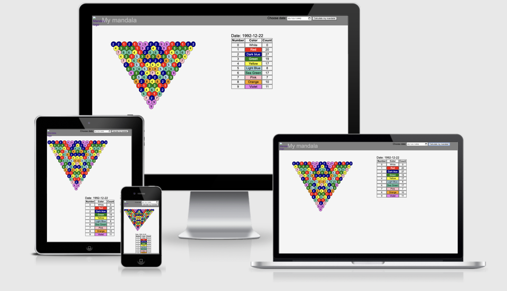
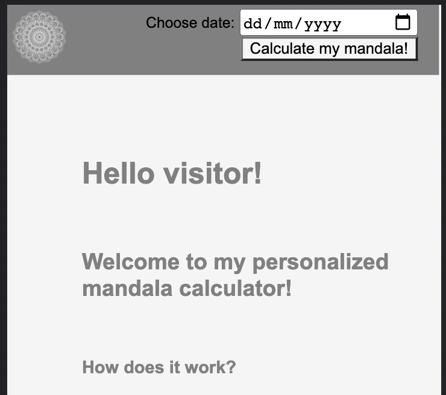
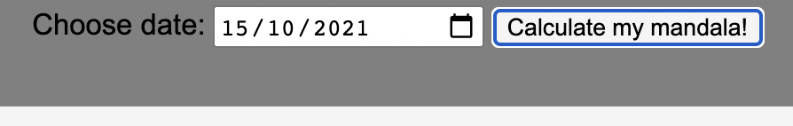
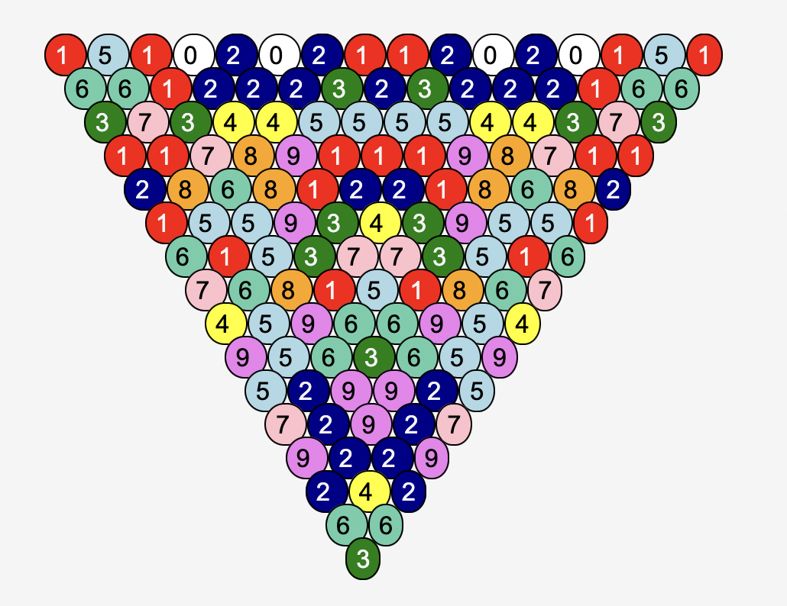
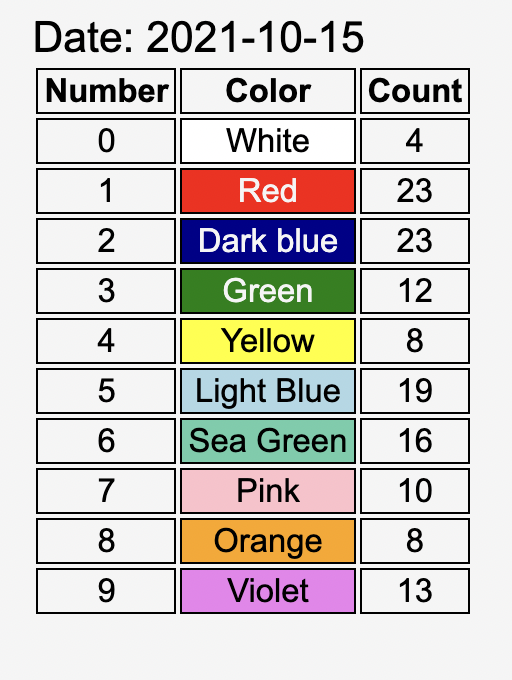
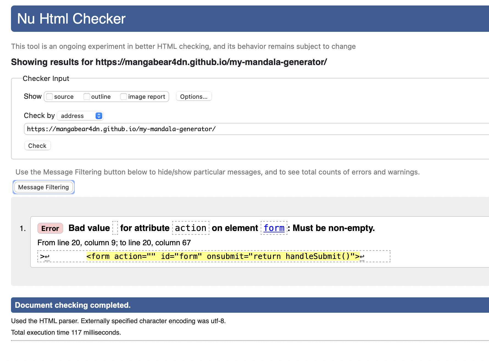
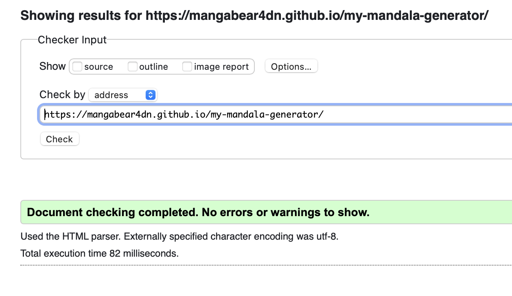
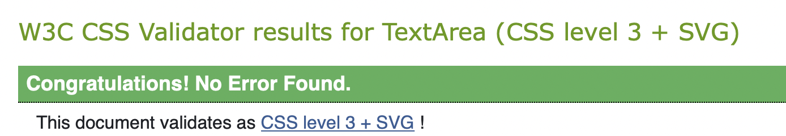
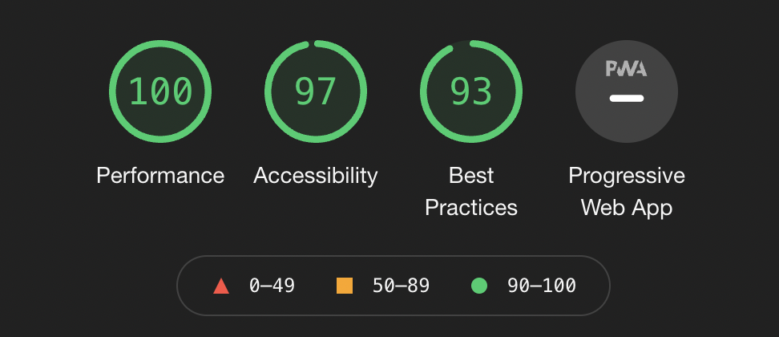

[Link to my website](https://mangabear4dn.github.io/my-mandala-generator/)

[Image created using: Am I Responsive?](http://ami.responsivedesign.is/#)

# My Personalised Mandala Calculator

This site was created to solve real life problem. The person who requested the site from time to time creates colorful personalized mandalas based on the date of birth given. Each mandala takes hours of work including the date calculations and the coloring of the cells. The sites purpose is to optimise the process of creating these personalised mandalas by doing the calculations for necessary. 

The information on how to do the calculations and how to visually represent them I did a phone consultation with the person and she also provided a material from a magazine (in Russian) that explains the process. ( [Resource1](assets/images/resource1.png), 
[Resource2](assets/images/resource2.png) )

Since the results ecpected of every calculation will be colorful the website was designed in neutral colors - black, grey, whitesmoke.

## Features 

### Existing Features

- __Title__

  - The title's purpose is to work as a link to refresh the page and a reminder what the page is for.
  - The text 'My mandala' is only visible on bigger screens.
  - The link is tied only to the mandala image in the corner.

- __Intro__

  - This an introduction to the site and it's purpose to anyone who finds it.
  - The text is mostly there as placeholder for the results. This text is overwritten by the results.
  - Code in index.html

- __Form__

  - This is a very simplistic form. It contains only label, date input field and the 'Calculate my mandala!' (submit) button.
  - The calculations are triggered by the submitting of the form.
  - The date field itself provides some validation to the input as well as the check that the value has been given (in js file) but the date itself isn't checked for realism. It is possible to pick any date as long as it meets the format.
  - I left this without restriction because mandalas can be drawn for any date and a casual visitor to the site that isn't interested in any specific calculations can play with it if they like.
  - Code in index.html

- __Mandala Slice__

  - This is the main attraction of the site. And the reason why this site would be interesting to the target audience.
  - The mandala slice is one of six identical segments that combined create the personalised mandala. Since the person who requested the site does the mandala drawing and coloring as an art work. The interest was to create a good reference to the number and color positions.
  - One color refers to only one kind of number and vice versa.
  - The calculations:
    - modify the date to be in the ddmmyyyyyyyymmdd format
    - count together each two elemnts next to each other together (in the mandala itself the calculation is directed inward)
    - if the sum is bigger than 9 then both digits are counted together as well, because the the entry to the next line can only be one digit long for each sum
    - the summing goes on untill there is only one digit left
  -Code in my_script.js

- __Table__

  - This was asked as an extra feature to help with the analysis of the mandala
  - It contains all possible numbers in the mandala, the color assigned to each and a number of times it appeared in the mandala displayed
  - Code in my_script.js

### Features Left to Implement

- Date entry by adding the date at the end of the URL link
- Adding similar calculations and visuals about a person's name as well.

## Testing

### Mandala slice creation

Finding a good and efective way to calculate the mandala slice from the date entry took moste of the raw coding time. The end result of the calculations looks very different tha the beggining of the first testable code.

The calculating in the end was divide in multiple functions:

- getDateString(dateInput)
  - This piece of the code takes the input of the form and returns a string of the date in a format ddmmyyyy
  - The first version of this code took the date of the current day and created the string from that but after the form with date input was added the parameter the function receives didn't need so many modifications and it was mostly transform as one string to another because the value passed to the funtion was in format yyyy-mm-dd

- mirrorDateString(str)
  - This function is only supposed to add a mirror af the parameter string at the end of it and return that (ddmmyyyyyyyymmdd)

- getPaired(str)
  - This string takes the mirror string and creates pairs to be used for the calsulations later. It terurns the pairs as an array of arrays. All subarrays are size 2.

- getSummed(arr)
  - Takes the result array pair, adds together and if necessary calls itself to repeat the process for any sum thats bigger than 9.
  - Parameter received is a size 2 array and the returned value is a new string of one element

- getNewString(arr)
  - Iterates the array of arrays of pairs, calls theSummed function on each of the pairs, adds all the new sums to a new string that it returns

- getNumbersPie(dateStr)
  - Creates the mandala slice matrix by iterating some of the previously mentioned functions

- caller(dateInput)
  - Takes date input and returns the mandala matrix
  - This function only calls other functions to get the result needed.

- handleSubmit(event)
  - Validates the sumbit
  - Calls the caller function
  - Creates the html code for the mandala pie slice matrix
  - Creates the html code for the table of counts
  - returns false to keep the page from reseting to the begginig state a milisecond after sumbit

### Validator Testing 

- HTML
  
  
  - There was only one error notice in the HTML validator and it was quicly resolved [W3C validator](https://validator.w3.org/nu/?doc=https%3A%2F%2Fcode-institute-org.github.io%2Flove-running-2.0%2Findex.html)

- CSS
  
  - Everything was ok after testing the CSS [(Jigsaw) validator](https://jigsaw.w3.org/css-validator/validator?uri=https%3A%2F%2Fvalidator.w3.org%2Fnu%2F%3Fdoc%3Dhttps%253A%252F%252Fcode-institute-org.github.io%252Flove-running-2.0%252Findex.html&profile=css3svg&usermedium=all&warning=1&vextwarning=&lang=en#css)

- JS
  - After the creation of most of the JS function that were workable before the form was created. I tested them individually in the python tutor by rearranging the code to have the necessary inputs from the outside in.
  - Testing the whole JS code wasn.t possible because the python tutor can handle only 1000 actions and that number was exceeded by only 3 or 4 lines of mandala calculated.
  [PythonTutor](https://pythontutor.com/visualize.html#mode=edit)

- Chrome Dev Tools
  - most of the testing and debugging at the later part when the JS code was too heavy for the python tutor was done by Chrome Dev Tools (console watching, debugger, inspecting elements etc)
  
  - The final tests with Lighthouse showed good results

### Unfixed Bugs

As of this moment all known bugs have been fixed.

## Deployment

For the site creation was used the GitHub dev enviroment GitPod. The project was created using the CI template available on GitHub.

The site was published on GitHub Pages (in GitHub settings using main branch and root access)

When the site was first published the site didn;y work. But I had this same issue on the previous project and the solution the was to simply to make an insignificant change on one of the files on the project and the 'git push -f' the local repository to GitHub. And the solution worked out.

After this there wasn't any issue with the published site.

## Credits 

- The mentor Guido Cecilio was a lot of help during the project - with advices and suggestions 
- Developer Mozilla docs were used to look up the Date, String and Array functions especially 
- Some stackflow content as well (references next to the code parts)
- Vineta Kokenberga provided the information and necessary results of the site's end product
- The previously mentioned validators, code checkers and debuggers were used
- Code institute materials, personal notes of them
- other with references next to the relevent sections (like Am I Responsive in this document)
- The mandala images were Google searched